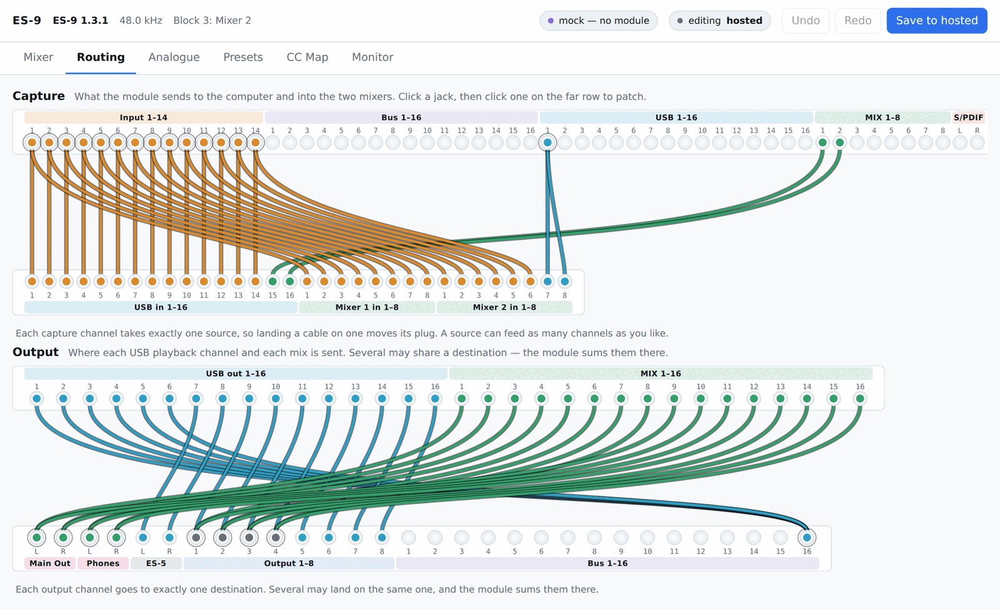

# ES-9 Mixer

An alternative control surface for the [Expert Sleepers ES-9](https://expert-sleepers.co.uk),
built around its MIDI SysEx protocol.



Ableton can route audio to and from the ES-9 but cannot touch the module's internal gain
and routing. This drives the module's own matrix mixer directly — and, more to the point,
lets a configuration be built on the desktop and then carried into a DAW-free live rig
where a MIDI controller rides the mix.

Routing is drawn as a patchbay rather than a grid because the module's rule is a
patchbay's rule: **every capture channel takes exactly one source, and every block output
exactly one destination.** Repatching moves a plug. A jack carrying more than one cable is
ringed, so fan-out on the source side and the module's summing on the destination side are
both visible without counting cells.

## Requirements

- **Windows 10 or 11.** The ES-9's ASIO driver and WebView2 are both Windows-only; there
  is no macOS or Linux build, and metering could not work without ASIO.
- **ES-9 firmware 1.3.x.** Firmware 1.2 sends a different configuration dump and is
  detected and rejected rather than misparsed — update the module first.
- **The Expert Sleepers ASIO driver**, for metering. The mixer, routing and everything
  else works without it; only the Meters tab needs it.
- **A DM4 DIN MIDI breakout**, only if you want CC control of the mixer with no computer
  attached. The ES-9's USB port is a device port, so a USB controller cannot plug into the
  module directly.

There is no installer or prebuilt binary yet; see [Building](#building-windows).

## Try it without an ES-9

The whole frontend runs against an offline mock, in an ordinary browser, on any platform:

```sh
make rundev             # compile the bridge to WASM, then serve web/
```

Then open <http://localhost:8777> (`make rundev PORT=9000` to move it). It is the mock
**always** — there is no MIDI in a browser, so nothing done there can reach a module, and
the header says so. The screenshots above are that build.

Needs a Rust toolchain with the `wasm32-unknown-unknown` target and `wasm-bindgen-cli`.

## Before you point it at your module

This application writes to the module's live configuration.

- **Archive both flash slots before you start.** The Presets tab saves the current
  configuration as a plain `.syx` file; do that for each slot, and keep the files.
- **Nothing is written to flash until you press Save.** Edits, resets and preset loads
  change only the running configuration, and Undo reverses them.
- **A factory reset replaces your routing too**, not just the mixer levels.
- **Loading a preset has not been tested against hardware.** The upload transport it uses
  is verified and the operation is covered by tests through the mock, but nobody has
  watched the button work on a real module. It replaces the entire configuration. The app
  says so where the button is.
- **Close your DAW before connecting.** MIDI on Windows is not multi-client: with Ableton
  or Resolume holding the ES-9's MIDI port, this app cannot open it. Metering is the
  confusing part — the ASIO driver *is* multi-client, so the meters will happily run while
  nothing else works.

## What's in it

| Tab | What it does |
|---|---|
| **Mixer** | 16 mixes × 8 channels. Level and pan, in dB, with numeric entry. Stereo links restructure the strips. |
| **Routing** | The two patchbays above: sources into capture channels, then block outputs into destinations. |
| **Analogue** | Input DC blocking and output DC offsets, with the inert ones marked. |
| **Meters** | Sixteen channels at 48 kHz over ASIO, with a DC column. |
| **Presets** | Factory defaults, and your own configurations saved as `.syx`. |
| **CC Map** | Exactly which CC drives which control, for the current link configuration. Stereo links live here, because a link rewrites the map. |
| **Monitor** | Every byte in and out, decoded. Doubles as the manual's own method for identifying a control's CC. |

The header states what the window is attached to — connected, searching, not connected
with a Reconnect button, or mock — because a tool that quietly accepts edits it cannot
deliver is worse than one that refuses them.

## Status

Working and installed on the author's rig. The protocol layer is verified against a real
ES-9 on **firmware 1.3.1** — the pan storage, the macro/raw precedence and the chunked
config upload are measured rather than assumed, and where the hardware disagreed with the
manual, the hardware is what is implemented.

### Known limitations

- **No MIDI channel assignment UI yet.** `0x35` is implemented but unexposed, so the
  module's CC channel has to be set with another tool before a controller can reach it.
- **No CC map export.** The map is on screen only.
- **No manual port picker.** The module is found by sending a version request to every
  MIDI port pair and keeping whichever answers, because Windows MIDI Services publishes it
  under a generic jack name with no "ES-9" in it. If something else answers first, there
  is currently no way to override the choice.
- **No user labels** for sources and destinations.
- **Input EQ, codec reset and the DSP usage readout** are documented in the protocol notes
  but have no UI.
- **Preset load is untested on hardware**, as above.
- Several decodings are plausible but unconfirmed by ear — the physical input and output
  permutations, and which input pair each DC-blocking bit governs. They are listed in
  [`features/mixer-ui/devstate.md`](features/mixer-ui/devstate.md) under *Not verified*,
  which is the honest inventory of what is known versus assumed.

## Building (Windows)

You need: the MSVC toolchain, [Rust](https://rustup.rs), LLVM (for `libclang`, which
bindgen needs), and the Steinberg ASIO SDK.

```powershell
winget install LLVM.LLVM
git clone --depth 1 https://github.com/audiosdk/asio.git "$env:USERPROFILE\asiosdk"
powershell -ExecutionPolicy Bypass -File scripts\win-install.ps1
```

The ASIO SDK is Steinberg's, and that clone is a third-party mirror of it; the official
download is at [steinberg.net/developers](https://www.steinberg.net/developers/). Either
way, the build finds it automatically if it is at `%USERPROFILE%\asiosdk`, or you can pass
`-AsioDir` or set `CPAL_ASIO_DIR`. Same for LLVM: found on `PATH` or via `-LibClang`.

`win-install.ps1` builds a release binary, installs it to
`%LOCALAPPDATA%\Programs\ES-9 Mixer` and adds a Start Menu shortcut. Per-user, so no
elevation; re-run it to upgrade. Windows does not let applications pin themselves to the
taskbar, so for that: find **ES-9 Mixer** in the Start menu, right-click, **Pin to
taskbar**.

To run from source without installing:

```powershell
powershell -ExecutionPolicy Bypass -File scripts\win-build.ps1 -App -Run
```

Presets live in `%APPDATA%\es9-mixer\presets` as plain `.syx` configuration dumps, so
they interchange with anything else that speaks the protocol.

If the working copy is in WSL2, `make win-install` drives the same script on the Windows
host — Windows `cargo` builds straight from the `\\wsl$` path.

> **Editing `web/` requires rebuilding the shell.** Tauri bakes the frontend into the
> binary at compile time, so re-running an old executable shows the old UI. The build
> script watches `web/`, so a rebuild is enough — but it has to be a rebuild.

## Layout

| Path | What it is |
|---|---|
| `crates/es9-protocol` | SysEx codec. Pure: no I/O, no platform dependencies. |
| `crates/es9-device` | Device state, actions, undo, offline mock, presentation model. Pure. |
| `crates/es9-midi` | `midir` transport, SysEx reassembly, protocol monitor, `probe` binary. |
| `crates/es9-meter` | Meter ballistics and level readouts. Pure: no backend, no I/O. |
| `crates/es9-audio` | ASIO/WASAPI capture, `audioprobe` binary. GPL-3.0. |
| `crates/es9-app` | Tauri desktop shell. Its own workspace — Tauri cannot build on Linux. GPL-3.0. |
| `crates/es9-wasm` | Browser bridge driving the mock. |
| `web/` | One frontend; picks the Tauri backend or the WASM mock at load time. |
| `docs/es9-sysex-protocol.md` | The protocol, as measured. The most reusable thing here. |
| `features/mixer-ui/` | Requirements, remaining work, and the current development state. |

## Development

```sh
make            # list the targets
make test       # workspace unit and integration tests
make smoke      # end-to-end through the WASM bridge, headless
make check      # both
```

Everything above runs on Linux with no hardware. The hardware-facing work cannot: WSL2 has
no sound subsystem and no USB passthrough, so the module, its ASIO driver and the MSVC
toolchain are all on the Windows host.

```powershell
powershell -ExecutionPolicy Bypass -File scripts\win-build.ps1 -Probe        # MIDI: dump, decode, checklist
powershell -ExecutionPolicy Bypass -File scripts\win-build.ps1 -AudioProbe   # audio: enumerate, open, meter
```

`probe` is read-only and archives a full dump before anything else; its write-side spikes
are behind `--write-tests`. Run it with no port arguments first and it lists the ports and
stops, then pass `-In`/`-Out` with the indices — the ES-9 cannot be found by name.

[`features/mixer-ui/`](features/mixer-ui/) is the contract, the remaining work and the
current state of what is verified. Read `devstate.md` first.

## Why ASIO, and not WASAPI

Not latency — nothing here is in the signal path; the ES-9 mixes in hardware and the host
only observes. WASAPI shared mode can only run at the Windows endpoint's configured
format, and opening a meter stream on it **re-clocked the module from 48 kHz to 32 kHz**,
where it stayed until ASIO restored it. A tool that silently changes the rig's clock to
draw its meters is not acceptable.

## Licence

MIT for everything except the audio backend: `crates/es9-audio` links the Steinberg ASIO
SDK under its **GPLv3** option, so that crate and the desktop shell that links it are
GPL-3.0-only. The boundary is drawn there and nowhere else, so a host that cannot carry
GPLv3 code can still use the whole protocol, device model and metering stack and supply
its own capture.

See [LICENSE.md](LICENSE.md) for the per-path map.

## Credit

The protocol was read from the ES-9 user manual's SysEx appendix and from Expert Sleepers'
own MIT-licensed configuration tool at
[expertsleepersltd/ES-9_tools](https://github.com/expertsleepersltd/ES-9_tools).

This project is not affiliated with or endorsed by Expert Sleepers Ltd.
